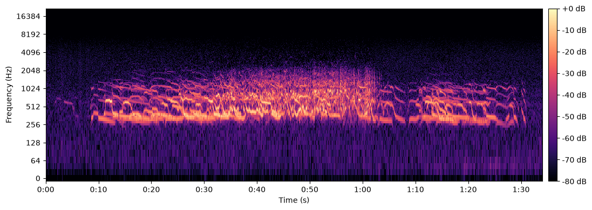
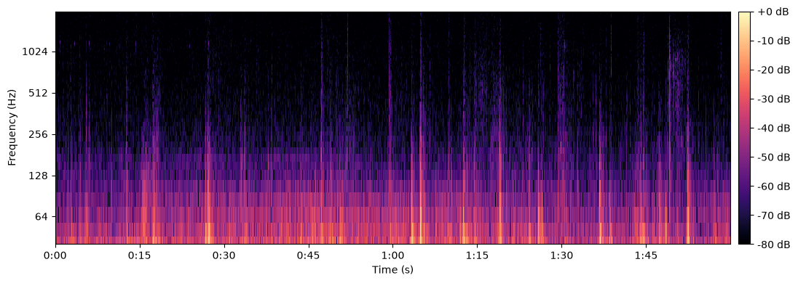
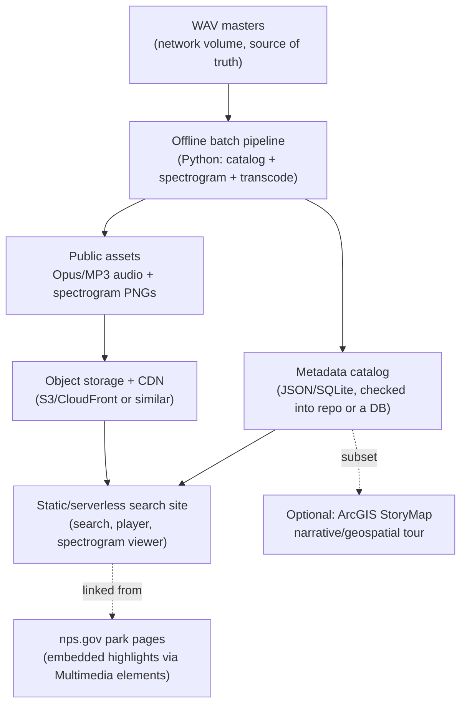

# Soundscapes of Alaska — Project Scoping

*Working name from `random_notes.md`. This document synthesizes exploration of the source data (`/Volumes/NPS_ADSB_Data/NPS_Type_1_Acoustic_Audio_Highlights/`, ~44GB / ~4,210 files) plus hands-on prototyping completed in this repo: full audio clips catalog, hand-curated MVP highlights set, spectrogram batch, and MP3 transcode (`scripts/`, `data/`, `highlights/audio/`, `highlights/spectrograms/`).*

## 1. Vision

A public, searchable library of NPS Alaska-region acoustic highlights — audio + spectrogram, side by side — that lets someone search "wolf pack," "glacier surge," or a species name and get back a clip they can play, see visualized, and download. Secondary goal: teach the public how to read a spectrogram and how NPS actually finds these sounds (via the existing SPLAT workflow: continuous 1s-resolution SPL + spectrogram monitoring → event discovery → clip extraction). Tertiary goal: give interpretive rangers a fast way to grab a good clip for a program.

## 2. What we actually have

| Category | Files | Size | Content |
|---|---|---|---|
| BIRD ID | 3,350 | 31 GB | Species highlights; ~1,134 have real taxonomic metadata via Xeno-Canto upload sheets (genus/species/lat-long/quality/license) |
| MAMMAL REFERENCE | 334 | 3.4 GB | Wolves, bears, whales (Glacier Bay humpbacks), squirrels, marmots, unknowns |
| HUMANS OH HUMANS | 322 | 6.8 GB | Aircraft, vehicles, and **candid human speech — not public-safe** |
| GEOPHONY | 95 | 1.5 GB | Rockslides, thunder, glacier calving/surge, surf |
| GENERAL | 54 | 813 MB | Misc/uncertain natural sounds |
| INSECTS | 47 | 365 MB | Mosquitoes, moths, orthopterans |
| Alaska Sound Showcase pt. 2 | 4 | 46 MB | Already hand-curated highlight reel — worth reviewing as a seed set |

**Format:** 16-bit PCM WAV, mostly mono, 44.1kHz masters (3,161 wav / 1,045 mp3 / 5 aiff). Good, consistent quality — no re-recording or upsampling needed.

**Naming convention** (parses cleanly for 96% of files via `scripts/build_catalog.py`):
`{PARKCODE}{SITECODE}_{YYYYMMDD}_{HHMMSS} {free-text description}.wav`
e.g. `WRSTBLMT_20170128_072543 excellent wolf pack howling.wav`

**Existing metadata to build on:**
- Xeno-Canto batch-upload spreadsheets (`BIRD ID/for xeno-canto/`) give ~1,134 bird clips real genus/species/lat-long/quality/license fields — the strongest existing structured metadata in the whole collection.
- `SITE DESCRIPTIONS.rtf` gives short habitat blurbs per site code.
- Raven selection tables / `.pkf` sidecars exist for a handful of mammal clips (frequency/power stats) but aren't a general solution.
- **No master catalog exists today.** We built one: `data/audio_clips_catalog.csv` (4,210 rows: park/site/date/description/category/sensitivity flag/XC join).

## 3. Concerns to flag before going further

1. **Privacy — this is the big one.** `HUMANS OH HUMANS/censored/` and `FRONTCOUNTRY TAKEOFF CLIPS/` exist specifically because they contain identifiable named people and candid conversations (e.g., staff discussing incidents, visitors talking near aircraft). Filenames reference real names (*"Brad Ebel and Denny Capps discuss Toklat," "possibly Peter Neitlich"*). Recommend a full manual/legal review of anything touching human voices before any public release — folder-based filtering catches the obvious cases (322 files already flagged) but a named-person search across *all* filenames, not just that folder, is worth doing once before launch.
2. **Rights-restricted content.** The `MAMMAL REFERENCE/Ground Squirrel Alarms — Dr. Brian Barnes UAF` set has an explicit "NPS Interpretive use ONLY" permission — it cannot go on a public website without separately renegotiating rights with the recordist.
3. **Species-ID confidence.** Many filenames hedge ("possibly," "IS THIS REALLY A TUNDRA SWAN," "unknown"). A public "search by species" feature must carry a verification/confidence field and should not surface unverified guesses as fact — likely needs a lightweight expert sign-off pass, at least for the ~560 files currently in `UNIDENTIFIED` / `issues` / `duff stuff` piles.
4. **Data integrity.** At least one zero-byte/corrupted file turned up in casual sampling (`GAARARRI_20180608_073133...MP3` — confirmed corrupt when the spectrogram subagent tried to decode it; a same-name `.wav` was fine). A full-collection integrity scan (can decode every file cleanly?) should be step zero of any real ingestion pipeline.
5. **508/accessibility compliance.** Any NPS-adjacent public site needs Section 508 compliance (confirmed via NPS's own StoryMap guidance) — spectrogram images need alt text, audio needs text-equivalent descriptions (the free-text filenames are a decent start), and any custom interactivity needs keyboard/screen-reader support.
6. **Governance/hosting approval.** Per NPS Director's Order #70, nps.gov itself only accepts pre-approved CMS "elements" (multimedia audio/video embeds, ESRI StoryMap embeds) — a custom searchable app cannot simply be dropped into nps.gov. Any non-NPS third-party hosting (AWS, GitHub, etc.) technically requires a formalized agreement. Worth identifying an NPS Digital Experience / IT point of contact early if the goal is eventually folding this under the nps.gov namespace, rather than after a site is built.
7. **Long-term maintenance.** SPLAT-based discovery presumably keeps producing new highlight clips. Who owns adding new clips to the public catalog going forward, and who owns the hosting bill/domain renewal, matters for choosing a low-maintenance architecture (see §5).

## 4. What we prototyped (real data, not guesses)

### Spectrogram generation
Early exploration used `archive/prototype/generate_spectrograms.py` against wolf howls, whale breaching, Muldrow glacier surge, bird chorus, insects, and rockslide clips. Production batch for the MVP highlights set runs via `scripts/generate_highlights_spectrograms.py` — **complete:** 156 PNGs for 126 clips (126 standard + 30 GEOPHONY `_lowfreq.png` variants), 0 failures. Report: `data/spectrogram_generation_report.json`.

- **`n_fft=2048, hop_length=512`** is the right default balance of time/frequency resolution for this content. `n_fft=1024` resolves fast bird trills better; `4096` looks worse for anything with rapid temporal structure and costs ~2x render time for no benefit here.
- **Low-frequency content needs a dedicated view.** A standard 0–22kHz log-scale plot compresses geologic rumble into an unreadable sliver at the bottom. A cropped 0–2000Hz variant makes the Muldrow surge's pulsing structure clearly visible (see below) — auto-generated for all geophony clips in the highlights set.
- **Render cost:** ~10-60s per clip on a laptop CPU (mostly WAV decode time, scales with duration), ~150-450KB per PNG at 1200x400px. For ~4,000 clips that's comfortably batchable overnight on a single machine, and the image assets add up to only ~1-2GB total — a rounding error next to the audio.
- **At least one file failed to decode** during early exploration (the corrupt MP3 mentioned above) — confirms need for a validation pass on any future full-collection ingest.

**Wolf pack howling** (`WRSTBLMT_20170128_072543`) — this is genuinely the kind of visual that sells the "look what sound looks like" educational hook:



**Muldrow glacier surge, cropped to 0-2000Hz** — pulsing low-frequency rumble events, invisible in a full-range plot:



### Audio compression trade-offs
Transcoded real samples (geologic/mammal/bird/insect) to MP3/AAC/Opus at multiple bitrates (`archive/prototype/compression_comparison.csv`).

| Format | Full-collection est. size | Notes |
|---|---|---|
| WAV masters (current) | ~44 GB | Keep as source-of-truth for spectrogram generation & researcher downloads only |
| **Opus 96kbps (recommended default)** | **~5.7 GB** | Best size/quality balance; native browser support (Chrome/Firefox/Edge/Safari 17+) |
| MP3 192kbps (fallback) | ~12 GB | For legacy compatibility / direct-download links |
| MP3 128kbps | ~8 GB | Reasonable single-format middle ground if avoiding Opus entirely |
| Opus 64kbps | ~3.8 GB | Too aggressive — audible HF softening on bird/insect content |

**Important:** lossy compression (any of the above) measurably alters high-frequency bird/insect detail and can clip near-DC geologic rumble. **Spectrograms should always be generated from the WAV masters**, never from the lossy streaming derivative, if we're claiming educational/scientific accuracy.

**MVP decision:** shipped MP3 192kbps for the 126-clip highlights set (~298 MB audio). Spectrograms were generated from WAV masters before local WAV copies were removed; benchmark data still supports Opus as a future option for a larger deploy.

### Metadata catalog
`scripts/build_catalog.py` walked the full tree (no audio decoding, so it's fast — ~30s) and produced `data/audio_clips_catalog.csv`:
- 4,210 rows, 96.2% parsed with high confidence
- 322 flagged sensitive (all of `HUMANS OH HUMANS`)
- 1,134 joined to Xeno-Canto taxonomic data
- 57 fully unparsed filenames (legacy date formats, non-standard names) — small enough to hand-clean

This gives a rough usable core: **4,210 − 322 (sensitive) − ~560 (unidentified/issues/duff) ≈ 3,300 candidate clips**, before any additional manual curation/quality pass.

## 5. Architecture recommendation



**Recommended layered approach (not either/or):**

1. **Quick win (weeks):** Hand-pick ~10-20 best, unambiguously-safe clips (wolf packs, whale breaching, Muldrow surge, a couple of standout bird choruses) and add them to relevant park pages on nps.gov using the existing Multimedia audio elements — exactly the pattern Yellowstone/Rocky Mountain/Glacier Bay already use for soundscape galleries. No new infrastructure, immediately public, builds institutional buy-in.
2. **Flagship build (the real ask):** A standalone static/serverless site — search by park, category, species, or free text; audio player with a pre-rendered spectrogram and a synced moving time-cursor (Merlin-style); download links for both the compressed stream and, optionally, the WAV master. Hosted outside nps.gov's CMS (since it can't host custom apps directly) but linked prominently from it, same pattern as the StoryMap links already in use. This is where wavesurfer.js or a simple `<audio>` + pre-rendered-image overlay comes in — **recommend pre-rendered images + a synced CSS/JS cursor over real-time in-browser spectrogram computation**, since it's far cheaper to serve at scale and looks identical.
3. **Optional stretch:** An ArcGIS StoryMap or a simple Leaflet/Mapbox map (per your `random_notes.md` geospatial idea) as a complementary narrative/exploration layer, linking back to the flagship site for the actual search experience. Good for a guided "tour" feel; not a replacement for search.

**Why standalone + link, not a fully custom nps.gov-native app:** confirmed via NPS's own developer docs that nps.gov's CMS only accepts pre-approved elements, and any new third-party tooling requires formal IRMD review. Building standalone first, then pursuing formal integration once it's proven, is the faster and lower-risk path — this can also be revisited once you have a working prototype to show around internally.

## 6. Metadata schema (proposed)

Extending `data/audio_clips_catalog.csv`, each public clip record should carry:

`id, title, park_unit, site_code, lat, long, recorded_date, recorded_time, category (geophony/bird/mammal/insect/general), species_common, species_scientific, tags[], description, duration_sec, sample_rate, source_format, license, credit/recordist, review_status (unverified/staff-reviewed/expert-verified), sensitive_flag, public_audio_url (opus), fallback_audio_url (mp3), spectrogram_url, lowfreq_spectrogram_url (geophony only), source_wav_path (internal only)`

## 7. Decisions made

- **Hosting:** standalone site, built to demonstrate the concept and show off the most interesting clips first (not starting with the full nps.gov-embed-only or StoryMap-only paths, though those remain reasonable follow-ons per §5).
- **v1 scope:** finalized **126-clip hand-curated highlights set** (Birds 33, General 10, Geophony 30, Insects 20, Mammals 33), not the full ~3,000-clip usable core. Expand later once the format is proven.
- **MVP audio format:** MP3 192kbps (~298 MB audio + ~47 MB spectrograms ≈ **345 MB** total deploy assets) — well under GitHub Pages limits. Opus remains the recommended default for a future full-collection deploy per benchmark data.

Still open, worth settling before final launch (not blockers for building the MVP):
- **Who signs off** on the human-speech exclusions and the Barnes rights-restricted set before anything goes public?
- **Budget/ownership** for hosting going forward (even ~$5-15/month at these data sizes) and who's the long-term point of contact for adding new SPLAT-discovered highlights.

## 7b. Phase 1: MVP build plan

**Curation (complete):** Human curation finalized **126 clips** across five categories. An earlier machine-ranking pass (`archive/mvp_curation/build_mvp_highlights_candidates.py` → `archive/mvp_curation/mvp_highlights_candidates.csv`, 2,384 ranked candidates) informed selection but was superseded by hand-picking. One wav+mp3 duplicate was deduped to a single MP3 per clip.

**Quality-modifier lexicon (confirmed empirically, not guessed):** the ranger who annotated these clips applied a semi-systematic vocabulary while labeling — verified via word-frequency analysis of `free_text_description`: `excellent` (40 uses), `very clear`/`relatively clear` (139), `good/high quality` (20), `clear` generically (598, weak positive), `no clipping` (mild positive) vs. `clipping`/`some clipping` (39, negative — audio distortion), `faint` (85, weak signal), `distant` (15), `distorted` (12), `poor` (rare, strong negative). This informed the machine-ranking pass; final clip selection was by ear. (Note: `great`/`greater` were deliberately excluded from this lexicon — they're almost entirely species names like "Great Grey Owl" and "Greater Yellowlegs," not quality remarks.)

Representative clips in the final highlights set:
- **Mammal:** wolf pack/pair howling with reverberation (multiple WRSTBLMT clips), humpback whale + Sooty Grouse mix
- **Geophony:** avalanche with birdsong, rockslide with Golden-crowned Sparrow background, glacier ice bubbling/creaking
- **Bird:** Varied Thrush song with humpback whale breaching in the background (a great "two things at once" clip), multi-species dawn chorus recordings
- **Insects:** grasshoppers stridulating, bumblebee with avian chorus
- **General/root:** Muldrow surge long cut, Denali Kennels dogs howling (fun/human-interest, verify appropriateness)

**Pipeline status:**
- ✅ Human curation complete (126 clips)
- ✅ Spectrogram batch complete (`scripts/generate_highlights_spectrograms.py` → 156 PNGs in `highlights/spectrograms/`)
- ✅ Transcode to MP3 192k complete (`scripts/transcode_highlights.py` → 126 MP3s in `highlights/audio/`, ~298 MB)
- ✅ ID3 metadata cleaned (`scripts/fix_highlights_metadata.py`)
- ✅ `data/highlights_catalog.json` built (`scripts/build_highlights_catalog.py`, 126 entries — site build input)

**Recommended MVP tech stack** (small catalog, low-maintenance goals):
- **Static site**, no backend/database — appropriate at 126 clips. Client-side search/filter via a small JSON index (Fuse.js or Lunr.js) is plenty fast and keeps hosting nearly free.
- **Static site generator** (Astro, 11ty, or even a hand-rolled Vite+vanilla-JS/React build) — generates one page per clip plus a searchable gallery/grid homepage.
- **Audio player:** `wavesurfer.js` for the waveform, paired with a pre-rendered spectrogram PNG/WebP and a synced time-cursor overlay (per §4 recommendation) rather than real-time in-browser spectrogram computation.
- **Assets:** MP3 192kbps audio + pre-rendered spectrogram images (Opus remains an option for a future larger deploy).
- **Hosting: GitHub Pages is sufficient for the MVP**, confirmed against actual highlights set sizes: **126 clips ≈ 345 MB** (298 MB audio + 47 MB spectrograms) — comfortably under GitHub Pages' 1GB soft site-size limit, with its 100GB/month soft bandwidth limit leaving plenty of headroom. Free custom domain + HTTPS included. WAV masters (44GB) are explicitly out of scope for this host and would need separate storage (S3/R2/on-request) whenever full-download is added later — deferring that is the right call for v1.
- **Metadata:** `data/highlights_catalog.json` (production catalog for site build); `data/audio_clips_catalog.csv` remains the full 4,210-file source catalog.

**Active pipeline** (re-run after highlights set changes):
```
.venv/bin/python scripts/build_highlights_catalog.py
.venv/bin/python scripts/generate_highlights_spectrograms.py
.venv/bin/python scripts/transcode_highlights.py --execute --remove-wav
.venv/bin/python scripts/fix_highlights_metadata.py --report
.venv/bin/python scripts/build_highlights_catalog.py
```

**Next steps checklist:**
1. Scaffold the static site (search/filter homepage + per-clip detail page with player + spectrogram + description + download links + credit/license), consuming `data/highlights_catalog.json`.
2. Legal/privacy sign-off on the final highlights set before publishing.
3. Deploy to GitHub Pages (or CDN-backed static host); link from nps.gov once ready (and separately pursue the quick-win nps.gov embed path from §5 in parallel if desired).

## 8. Repo contents from this exploration

**Active scripts:**
- `scripts/build_catalog.py` — walk source tree → `data/audio_clips_catalog.csv` (4,210 rows)
- `scripts/build_highlights_catalog.py` — build `data/highlights_catalog.json` (126 entries, site input)
- `scripts/generate_highlights_spectrograms.py` — batch spectrograms → `highlights/spectrograms/` (156 PNGs)
- `scripts/transcode_highlights.py` — WAV → MP3 192k → `highlights/audio/` (126 files, ~298 MB)
- `scripts/fix_highlights_metadata.py` — clean ID3 tags on highlight MP3s

**Data:**
- `data/highlights_catalog.json` — production catalog for MVP site build
- `data/audio_clips_catalog.csv`, `data/CATALOG_README.md` — full 4,210-file source catalog
- `data/spectrogram_generation_report.json` — batch spectrogram run report
- `data/metadata_fix_report.csv` — ID3 tag fix report
- `data/transcode_highlights_report.csv` — transcode run report

**Assets (gitignored):**
- `highlights/audio/` — 126 MP3 files (~298 MB)
- `highlights/spectrograms/` — 156 PNG files (~47 MB)

**Archived:**
- `archive/mvp_curation/` — superseded `build_mvp_highlights_candidates.py` + `mvp_highlights_candidates.csv`
- `archive/prototype/` — early `generate_spectrograms.py`, `transcode_comparison.sh`, `compression_comparison.csv`

**Removed:** `output/` (~97 MB prototype debris, deleted)
